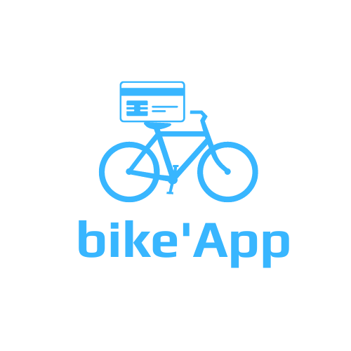
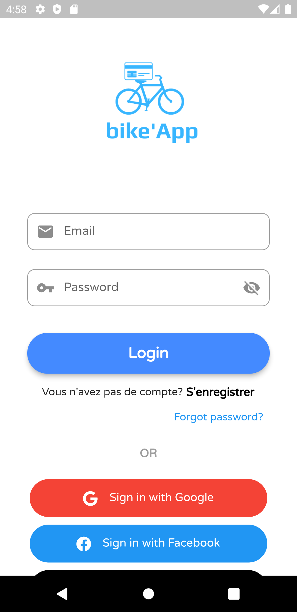
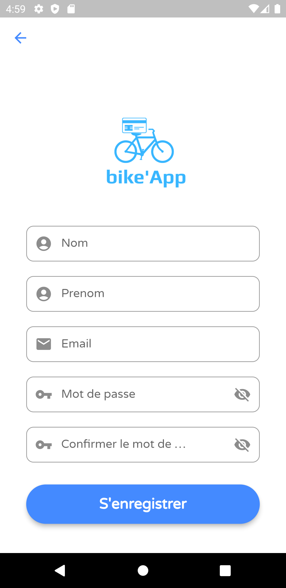
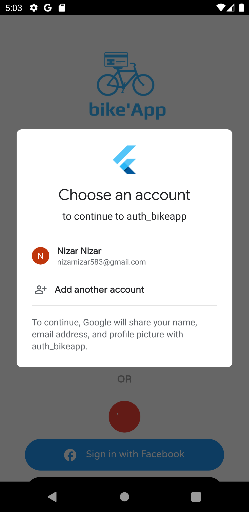
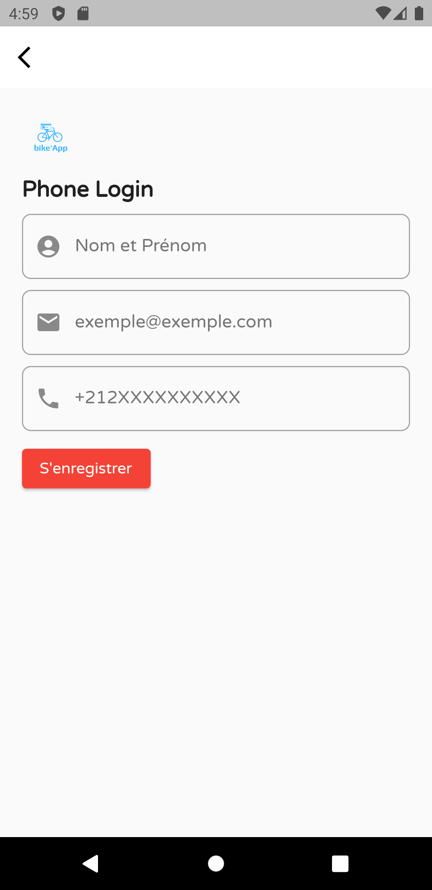
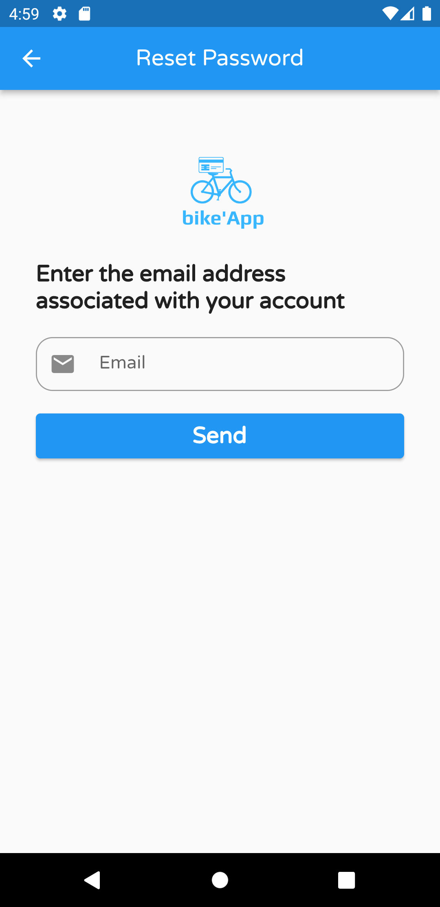
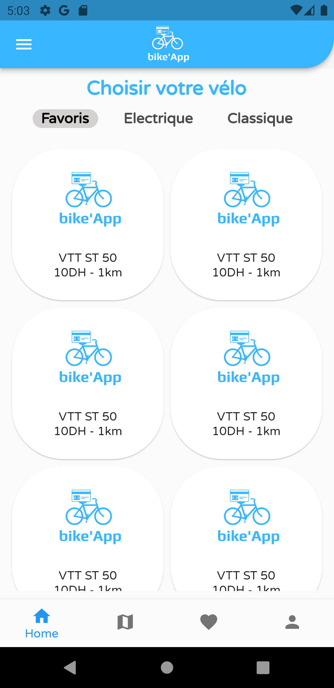
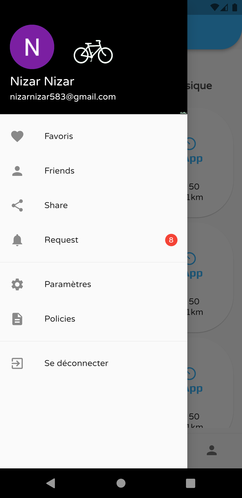
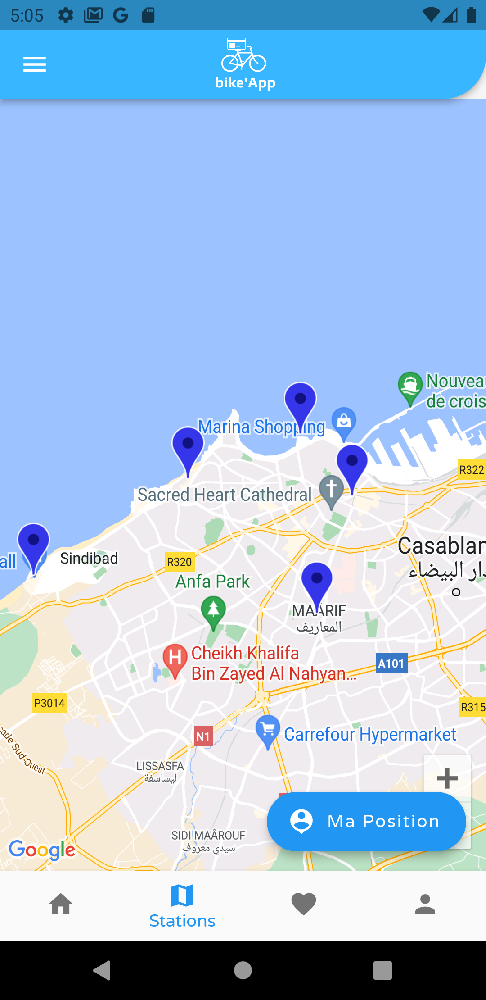

# BikeApp

BikeApp est une application mobile, de location des vélos,
qui vous permet de circuler rapidement et en toute sécurité, ainsi qu’analyser vos performances à l’aide de statistiques détaillées telles que (la durée, la distance, la vitesse,...) faites grâce au GPS de votre smartphone.

## Screen de connexion 

Ce screen vous permet de se connecter ou de choisir une autre méthode de connexion par Google, par Facebook ou par téléphone. Sinon vous pouvez créer un nouveau compte, et si vous avez oublié le mot de passe vous cliquez sur Mot de passe Oublié pour récupérer votre compte.

## Screen pour s'enregistrer

Ce screen vous permet de s'enregistrer par saisir votre Nom, Prénom, E-mail, et le Mot de passe.

## S'authentifier avec google

Quand vous cliquer sur Login avec Google cette page s'affiche pour choisir votre compte google et s'authentifier avec.

## Screen d'authentification avec Téléphone

Ce screen vous permet de se connecter avec la méthode du Téléphone, après de saisir le Nom, Prénom et l'E-mail
vous saisissez le numéro de téléphone et de saisir un code de confirmation.

## Screen pour récupérer le mot de passe

Quand vous cliquez sur Forgot Password ou Mot de passe oublié, cette page s'affiche pour saisir votre e-mail de votre compte, et un lien va être envoyé dans votre boite mail qui vous demande de saisir un nouveau mot de passe.

## Home Screen

C'est la page principal de l'application, cette page affiche toutes les vélos disponible avec leurs noms, modèles, types... , et aussi le menu en bas et le side bar 

## Side Bar

Ce screen affiche les informations sur votre comptes, votre photo de profile, nom complet, e-mail, et aussi vous pouvez voir des buttons comme les paramètres, et se déconnecter.

## Map Screen

Map Screen vous permet de voir tout les stations disponible et leurs noms qui contient des vèlos, vous pouvez aussi voir votre position en cliquant sur ma position.

## Dark Mode et Light Mode Interface

Toutes les interfaces du Dark Mode 

-- Profile

-- Modifier le profile

-- Paramètres

-- Sidebar

- [Cookbook: Useful Flutter samples](https://flutter.dev/docs/cookbook)

